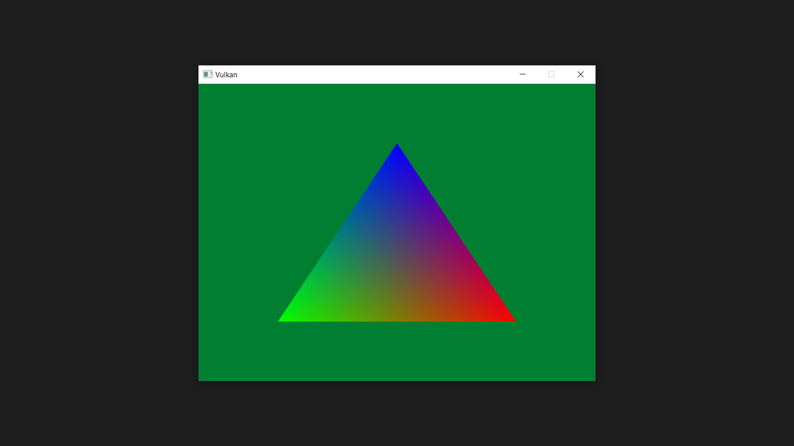

# Vulkan Ray Tracing from Scratch

Vulkan Ray Tracing を使って三角形を出せるようにするリポジトリ

## Features

-   サードパーティの Vulkan ライブラリを使用せずゼロから記述する
-   公式 C++ラッパー `vulkan.hpp` を使うため冗長な記述が少ない
-   レイトレーシングに必要最低限なプログラムを目指す
-   小さなヘルパーヘッダを 1 つだけ提供する
-   各ステップごとにプログラムを残しておく

## Requirement

-   Vulkan SDK 1.2.162.0 or later
-   C++17
-   CMake
-   vcpkg

Driver

-   GEFORCE GAME READY DRIVER 460.89 or later
